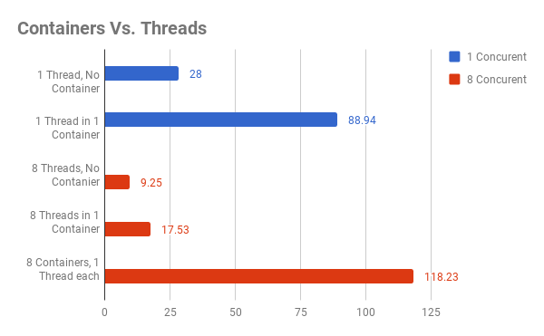

# checkers-ai
Project repository for CS-405 (Intro to AI)

## Docker

### Configs
To build the git portiion of the `checkers-ai/docker-tournament.cfg` file needs to be filled in.
This is used to get the networks out of the container.

    [git]
    username = <github username here>
    password = <github password here>
    url = <link to github repo>

### Building

Once the config file is done, build the container while in the
directory with the docker file with

    docker build -t train .

### Running

To start up the container run

    docker run train .

If theres is an error for some reason you can use

    docker run -it train bash

this gets you inside the container to poke around. To start everything off run

    ./docker-run.sh

### Benchmarks

There is a pretty significant performance hit from using containers for processing.
The times are to run a tournament consiting of 100 games. Units are in seconds.

